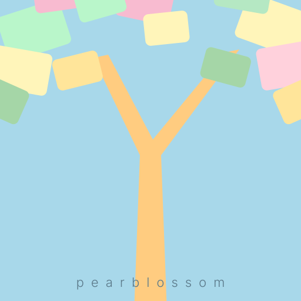

# Pearblossom

<p align="center">
  
</p>

A native macOS desktop app for creating multi-perspective photo collages — composite images made from overlapping, freeform-arranged photographs that build a larger scene from many individual shots.

## Inspiration

This project draws inspiration from the photo-collage tradition, including the "joiners" technique popularized by artists in the 1980s. The name "Pearblossom" references the pear tree blossom and the Southern California landscape.

> **Disclaimer:** Pearblossom is an independent open-source project. It is not affiliated with, endorsed by, or sponsored by David Hockney, The David Hockney Foundation, or the Getty Museum. See [`LEGAL.md`](LEGAL.md) for full legal notices.

## Tech Stack

- Swift (latest stable), macOS 14+
- SwiftUI + AppKit hybrid UI
- Core Image rendering (Metal-backed)
- Swift Package Manager
- Zero third-party dependencies

## Architecture

See [`ARCHITECTURE.md`](ARCHITECTURE.md) for the full architecture reference — data models, rendering pipeline, undo system, canvas behavior, file formats, and implementation constraints.

See [`AGENTS.md`](AGENTS.md) for LLM coding assistant conventions and instructions.

See [`DESIGN.md`](DESIGN.md) for the JSON file format specifications (`.collage.json` and `.collection.json`).

See [`LEGAL.md`](LEGAL.md) for legal notices, disclaimers, and copyright information.

## Viewing Logs

Pearblossom uses Apple's unified logging system. Debug logging is enabled by default (toggle in Settings → General → Developer).

**In Terminal:**
```bash
log stream --predicate 'subsystem == "com.pearblossom"' --level debug
```

**In Console.app** (`/Applications/Utilities/Console`): filter by `subsystem:com.pearblossom`.
